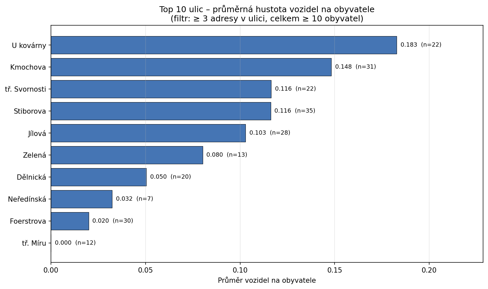

# Detekce a analýza vozidel z ortofota – Olomouc 2016

**Semestrální práce** | Pokročilé metody dálkového průzkumu Země (MEDPZ)  
**Autoři:** Petr Mikeska, Daniel Lee Číp  
**Oblast:** Neředín / Nová Ulice / Hodolany / Bělidla, Olomouc | 4× ortofoto 2016, ~10 cm/px, EPSG:5514

## Co projekt dělá

1. **Detekuje vozidla** ze 4 ortofot pomocí YOLOv8s-OBB + SAHI tiling
2. **Ořezává adresní body** RÚIAN na extenty každého snímku
3. **Vytváří Voronoi zóny** a analyzuje hustotu vozidel na obyvatele
4. **Porovnává korelace** věkových skupin × hustota vozidel přes všechna ortofota
5. **Hledá parkoviště** pomocí DBSCAN clusteringu
6. **Evaluuje kvalitu detekce** parametrickým sweepem bez ground truth

## Výsledky – přehled (všechna 4 ortofota)

| Ortofoto | Oblast | Vozidel | Adres | Největší parkoviště |
|---|---|---|---|---|
| 1 | Neředín / Nová Ulice | 1 022 | 512 | 232 voz., 41 173 m² |
| 2 | Nová Ulice (východ) | 639 | 389 | 51 voz., 6 210 m² |
| 3 | Hodolany | 678 | 445 | 113 voz., 25 375 m² |
| 4 | Bělidla | 829 | 224 | 247 voz., **76 151 m²** |

| Metrika | Hodnota |
|---|---|
| Nejsilnější věk. skupina | **0–14 let** (průměrný \|r\| = 0,141 přes 4 TIF) |
| Nejvýznamější korelace | TIF 4: 0–14 r=−0,297\*\*\*, 45–64 r=+0,293\*\*\* |
| Optimální `iou_match` | 0,3 → 0 % duplicit |

### Detekce vozidel na ortofotu


*Zelené boxy = malá vozidla, oranžové = velká vozidla. YOLOv8-OBB + SAHI tiling (640 px dlaždice, overlap 20 %).*

### Hustota vozidel na Voronoi zóny


*Vlevo: absolutní počty vozidel v každé Voronoi zóně. Vpravo: normalizováno na počet obyvatel adresy.*

### Srovnání korelací – všechna 4 ortofota


*Pearsonův r pro každou kombinaci ortofoto × věková skupina. Nejsilnější signály v TIF 4 (Bělidla): 0–14 let r=−0,297\*\*\*, 45–64 let r=+0,293\*\*\*.*

### Nejsilnější věková skupina: 0–14 let


*Scatter plot: podíl dětí (0–14 let) vs. hustota vozidel na obyvatele pro všechna 4 ortofota. Negativní korelace: adresy s více dětmi mají méně aut na osobu.*

### Souhrnné srovnání korelací


*Vlevo: Pearsonův r per ortofoto a věk. skupinu (hvězdičky = statistická signifikance). Vpravo: průměrný |r| přes 4 ortofota – věková skupina 0–14 let je nejkonzistentnější prediktor.*

### Distribuce hustoty vozidel


*Boxploty hustoty vozidel na obyvatele a absolutního počtu vozidel per Voronoi zóna pro všechna 4 ortofota.*

### Hustota vozidel podle ulic (TIF 1)



*Top 10 ulic v oblasti Neředín/Nová Ulice seřazených podle průměrné hustoty vozidel na obyvatele.*

### Evaluace: duplicitní detekce


*Modrá = unikátní detekce, červená = duplicitní box (IOS > 0,3 s jiným boxem stejné třídy). Aktuální nastavení: 2,6 % duplicit před sweepem; po nastavení `iou_match=0,3` → 0 %.*

### Parametrický sweep: vliv nastavení na duplicity


*`postprocess_match_threshold` (iou_match) je dominantní parametr. Při hodnotě 0,3 jsou duplicity eliminovány pro všechny kombinace conf × overlap.*

## Instalace

```bash
pip install geopandas rasterio scipy matplotlib scikit-learn sahi ultralytics
```

## Rychlý start

```bash
# Celý pipeline najednou (~30 min kvůli detekci)
python src/run_all.py

# Pokud vehicles.gpkg už existuje, přeskočí detekci
python src/run_all.py --skip-detect
```

## Skripty

### `src/detect.py` – Detekce vozidel

```bash
python src/detect.py --conf 0.25 --slice-size 640 --overlap 0.2
```

| Parametr | Default | Popis |
|---|---|---|
| `--conf` | 0.25 | Confidence threshold – vyšší = méně, ale přesnější detekce |
| `--slice-size` | 640 | Velikost dlaždic v px – menší = lépe malá auta, pomalejší |
| `--overlap` | 0.2 | Překryv dlaždic – vliv na duplicity minimální |

Výstup: `data/vectors/vehicles.gpkg`, `outputs/detection_preview.jpg`

> **Poznámka k parametrům:** Parametrický sweep (`src/evaluate.py`) ukázal, že klíčový parametr pro eliminaci duplicit je `postprocess_match_threshold=0.3` (nastaveno jako výchozí). `conf` a `overlap` duplicity téměř neovlivní.

### `src/analyze.py` – Prostorová analýza

```bash
python src/analyze.py
```

- Voronoi polygony z adresních bodů
- Počet vozidel v každé zóně (spatial join)
- Hustota vozidel na obyvatele (`density_per_resident`)
- Pearsonova korelace s věkovými skupinami (filtr: zóny ≥ 10 obyvatel)

Výstupy: `data/vectors/voronoi.gpkg`, `outputs/analysis_map.png`, `outputs/correlations.png`, `outputs/scatter_seniors.png`, `outputs/statistics.csv`

### `src/parking_analysis.py` – Rozšířená analýza

```bash
python src/parking_analysis.py
```

| Analýza | Výstup |
|---|---|
| Podíl velkých vozidel × věk | `outputs/size_ratio_correlations.png` |
| Vzdálenost od centra vs. hustota | `outputs/distance_vs_density.png` |
| Top 10 ulic – hustota vozidel | `outputs/street_density_top10.png` |
| DBSCAN parkoviště (eps=25 m) | `outputs/parking_clusters.gpkg` |
| Senioři vs. podíl velkých vozidel | `outputs/seniors_vs_large_ratio.png` |

### `src/evaluate.py` – Evaluace kvality detekce

```bash
# Analýza existujícího vehicles.gpkg (rychle)
python src/evaluate.py analyze

# Parametrický sweep 27 konfigurací (~20 min)
python src/evaluate.py sweep
```

Měří duplicity (IOS překryv boxů) a separaci tříd (plocha boxů) bez ground truth anotací.

### `src/tune.py` – Batch tuning modelů

```bash
python src/tune.py
```

Testuje kombinace nano/small/medium modelu × conf × slice_size na testovacím výřezu.

## Struktura projektu

```
data/
  raw/            # Ortofoto (.tif, gitignorováno)
  processed/      # Testovací výřezy (gitignorováno)
  vectors/        # GeoPackage výstupy (gitignorováno, generuje se)
  adr_ol.geojson  # Adresní body RÚIAN s demografií (EPSG:5514)
src/
  detect.py       # Detekce YOLOv8-OBB + SAHI
  analyze.py      # Voronoi analýza hustoty a korelací
  parking_analysis.py  # Clustering, ulice, vzdálenost
  evaluate.py     # Evaluace kvality bez ground truth
  tune.py         # Batch tuning parametrů
  run_all.py      # Spustí celý pipeline
outputs/          # PNG grafy, CSV statistiky (gitignorováno, generuje se)
poznatky.md       # Klíčové výsledky a interpretace
yolov8n-obb.pt    # Model (DOTA, nano)
```

## Klíčové poznatky

**Korelace věk × hustota vozidel:**  
Po normalizaci na počet obyvatel (density_per_resident) korelace zmizela (r = −0,13 až +0,14, p > 0,05). Dřívější zdánlivě silná korelace (r ≈ 0,5) byla artefakt — větší domy mají přirozeně více lidí i více aut v okolí.

**Klasifikace small/large vehicle:**  
Nespolehlivá — model YOLOv8-OBB trénovaný na DOTA (satelitní snímky) špatně rozlišuje třídy na 10 cm/px ortofotu. Mediány ploch boxů jsou shodné (~10,5 m²) pro obě třídy. Pro analýzu používáme pouze celkový počet vozidel.

**Optimální detekční nastavení:**  
`conf=0.25, overlap=0.2, postprocess_match_threshold=0.3` → 0 % duplicit.

## Tech stack

- **YOLOv8-OBB** (ultralytics) + **SAHI** – detekce na velkých snímcích pomocí dlaždic
- **GeoPandas** + **Shapely** – vektorová GIS analýza
- **Rasterio** – rastrové I/O
- **Scipy** – statistické testy (Pearson, Mann-Whitney)
- **scikit-learn** – DBSCAN clustering
- **Matplotlib** – vizualizace
